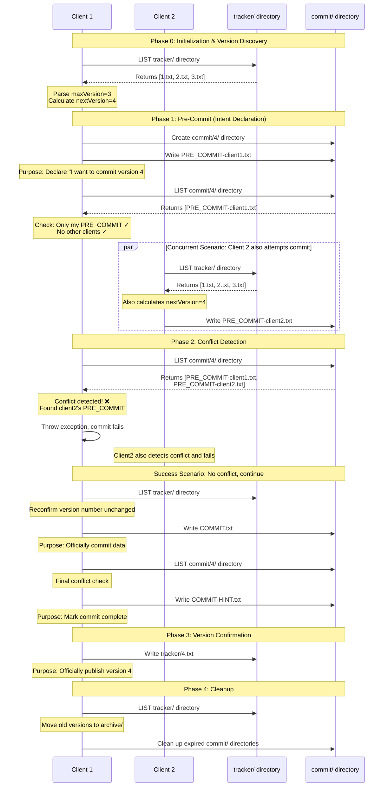

# FileTrackerCommitStrategyV2 - Step-by-Step Explanation

## Overview

FileTrackerCommitStrategyV2 implements a **two-phase commit protocol** for distributed consistency on object storage systems that lack atomic operations, file locks, and transactions.

**Core Idea**: Use file existence and directory listing as coordination mechanisms to detect concurrent modifications.

---

## Complete Commit Flow



---

## Filesystem State Evolution

### Success Case: Single Client Commit

```mermaid
graph TB
    subgraph State0["Initial State"]
        T0["tracker/<br/>├─ 1.txt<br/>├─ 2.txt<br/>└─ 3.txt"]
        C0["commit/<br/>├─ 1/<br/>├─ 2/<br/>└─ 3/"]
    end
    
    subgraph State1["Phase 1: Client1 writes PRE_COMMIT"]
        T1["tracker/<br/>├─ 1.txt<br/>├─ 2.txt<br/>└─ 3.txt<br/><br/>maxVersion=3"]
        C1["commit/<br/>├─ 1/<br/>├─ 2/<br/>├─ 3/<br/>└─ 4/<br/>    └─ PRE_COMMIT-client1.txt"]
        style C1 fill:#ffe6e6
    end
    
    subgraph State2["Phase 2: LIST check - No conflict"]
        T2["tracker/<br/>├─ 1.txt<br/>├─ 2.txt<br/>└─ 3.txt"]
        C2["commit/4/<br/>└─ PRE_COMMIT-client1.txt<br/><br/>✓ Only client1's file<br/>✓ Can proceed"]
        style C2 fill:#e6ffe6
    end
    
    subgraph State3["Phase 3: Write COMMIT"]
        T3["tracker/<br/>├─ 1.txt<br/>├─ 2.txt<br/>└─ 3.txt"]
        C3["commit/4/<br/>├─ PRE_COMMIT-client1.txt<br/>└─ COMMIT.txt"]
        style C3 fill:#e6f3ff
    end
    
    subgraph State4["Phase 4: Write HINT"]
        T4["tracker/<br/>├─ 1.txt<br/>├─ 2.txt<br/>└─ 3.txt"]
        C4["commit/4/<br/>├─ PRE_COMMIT-client1.txt<br/>├─ COMMIT.txt<br/>└─ COMMIT-HINT.txt"]
        style C4 fill:#fff3e6
    end
    
    subgraph State5["Phase 5: Publish version"]
        T5["tracker/<br/>├─ 1.txt<br/>├─ 2.txt<br/>├─ 3.txt<br/>└─ 4.txt ← New version!"]
        C5["commit/4/<br/>├─ PRE_COMMIT-client1.txt<br/>├─ COMMIT.txt<br/>└─ COMMIT-HINT.txt"]
        style T5 fill:#e6ffe6
    end
    
    State0 --> State1
    State1 --> State2
    State2 --> State3
    State3 --> State4
    State4 --> State5
```



---

## Detailed Step-by-Step Breakdown

### Phase 0: Version Discovery
**What we do:**
```java
List<FileEntity> trackerList = fileIO.listAllFiles(trackerDir, false);
long maxCommitVersion = trackerList.stream()
    .map(x -> Long.parseLong(x.getFileName().split("\\.")[0]))
    .max(Long::compareTo)
    .orElse(0L);
```

**Why:**
- Discover the current maximum version number
- Calculate the next version to commit
- This is the **only way** to coordinate version numbers in a distributed system without a central coordinator

**Result:**
```
tracker/
├─ 1.txt  → version 1
├─ 2.txt  → version 2
└─ 3.txt  → version 3

maxVersion = 3
nextVersion = 4
```

---

### Phase 1: Pre-Commit (Intent Declaration)

**What we do:**
```java
String preCommitFileName = PRE_COMMIT_PREFIX + UniIdUtils.getUniId() + ".txt";
URI preCommitFile = commitDetailDir.resolve(preCommitFileName);
fileIO.writeFileWithoutGuarantees(preCommitFile, preCommitFileName);
```

**Why:**
- **Declare intent**: "I want to commit version 4"
- Create a unique marker file with client ID
- This allows other clients to detect our presence
- **Critical**: This is NOT the actual commit, just a declaration

**Result:**
```
commit/4/
└─ PRE_COMMIT-abc123.txt  ← Client's intent marker
```

**Analogy**: Like raising your hand in a meeting to say "I want to speak"

---

### Phase 2: First Conflict Check

**What we do:**
```java
List<FileEntity> commitDetails = fileIO.listAllFiles(commitDetailDir, false);
if (hasConflict(commitDetails, preCommitFileName)) {
    throw new ConcurrentModificationException();
}
```

**Why:**
- Check if any other client also wants to commit version 4
- If we find other PRE_COMMIT files → conflict detected
- **Fail-fast**: Immediately abort if conflict detected

**Success Case:**
```
commit/4/
└─ PRE_COMMIT-abc123.txt  ← Only our file, safe to proceed ✓
```

**Conflict Case:**
```
commit/4/
├─ PRE_COMMIT-abc123.txt  ← Our file
└─ PRE_COMMIT-xyz789.txt  ← Another client! Conflict! ❌
```

**Analogy**: Check if someone else also raised their hand at the same time

---

### Phase 3: Write COMMIT

**What we do:**
```java
String commitFileName = "COMMIT.txt";
URI commitFile = commitDetailDir.resolve(commitFileName);
fileIO.writeFileWithoutGuarantees(commitFile, commitFileName);
```

**Why:**
- Write the actual commit data
- This is the "real" commit operation
- Still not visible to readers (version not published yet)

**Result:**
```
commit/4/
├─ PRE_COMMIT-abc123.txt
└─ COMMIT.txt  ← Actual commit data
```

---

### Phase 4: Second Conflict Check

**What we do:**
```java
commitDetails = fileIO.listAllFiles(commitDetailDir, false);
if (hasConflict(commitDetails, null)) {
    throw new ConcurrentModificationException();
}
```

**Why:**
- **Double-check**: Ensure no other client snuck in between Phase 2 and now
- Object storage has eventual consistency, need to verify again
- This is the **final safety check** before publishing

**Analogy**: Look around one more time before you start speaking

---

### Phase 5: Write COMMIT-HINT

**What we do:**
```java
String hintFileName = COMMIT_HINT;
URI hintFile = commitDetailDir.resolve(hintFileName);
fileIO.writeFileWithoutGuarantees(hintFile, hintFileName);
```

**Why:**
- Mark the commit as "complete"
- Helps with recovery if client crashes
- Other clients can use this to complete partial commits

**Result:**
```
commit/4/
├─ PRE_COMMIT-abc123.txt
├─ COMMIT.txt
└─ COMMIT-HINT.txt  ← Completion marker
```

---

### Phase 6: Publish Version

**What we do:**
```java
String trackerFileName = maxCommitVersion + 1 + ".txt";
URI trackerFile = trackerDir.resolve(trackerFileName);
fileIO.writeFileWithoutGuarantees(trackerFile, trackerFileName);
```

**Why:**
- **Make version visible** to all readers
- This is the moment version 4 becomes "official"
- Readers discover new versions by listing tracker/ directory

**Result:**
```
tracker/
├─ 1.txt
├─ 2.txt
├─ 3.txt
└─ 4.txt  ← New version published! 🎉
```

**Analogy**: Publishing a new book - now everyone can see it

---

### Phase 7: Cleanup

**What we do:**
```java
moveTooOldTracker2Archive(fileIO, trackerList, maxCommitVersion, archiveDir, trackerDir);
cleanTooOldCommit(fileIO, archiveDir, commitDirRoot);
```

**Why:**
- Keep only recent versions (e.g., last 2 versions)
- Move old versions to archive/
- Prevent unlimited growth of metadata
- Maintain system performance

**Result:**
```
tracker/
├─ 3.txt  ← Keep recent
└─ 4.txt  ← Keep recent

archive/
├─ 1.txt  ← Archived
└─ 2.txt  ← Archived
```

---

## Why So Many LIST Operations?

### The Challenge
Object storage systems lack:
- ❌ Atomic rename
- ❌ File locks
- ❌ Transactions
- ❌ Strong consistency

### The Solution
Use **LIST operations** as the coordination mechanism:

1. **LIST #1** (Phase 0): Discover current version
2. **LIST #2** (Phase 2): Check for conflicts after PRE_COMMIT
3. **LIST #3** (Phase 4): Final conflict check before COMMIT
4. **LIST #4** (Phase 6): Verify version before publishing
5. **LIST #5-7** (Phase 7): Cleanup operations

**Trade-off**: 
- ✅ Achieves distributed consistency
- ⚠️ Requires 5-7 network round trips
- ⚠️ Performance bottleneck for high-frequency commits

---

## Conflict Resolution Example

### Timeline: Two Clients Compete

```
Time  Client1                          Client2
----  --------------------------------  --------------------------------
T0    LIST tracker/ → maxVersion=3     
T1    Calculate nextVersion=4          LIST tracker/ → maxVersion=3
T2    Write PRE_COMMIT-client1.txt     Calculate nextVersion=4
T3                                     Write PRE_COMMIT-client2.txt
T4    LIST commit/4/                   
T5    → Find [PRE_COMMIT-client1.txt,  LIST commit/4/
         PRE_COMMIT-client2.txt]       → Find [PRE_COMMIT-client1.txt,
T6    → Conflict! Abort ❌                PRE_COMMIT-client2.txt]
T7                                     → Conflict! Abort ❌
T8    Retry with version 5             Retry with version 5
```

**Result**: Both clients detect the conflict and retry with the next version

---

## Final Directory Structure

### Complete Example After Multiple Commits

```
rootPath/
├── tracker/                    # Version registry
│   ├── 3.txt                  # Version 3 (kept)
│   └── 4.txt                  # Version 4 (latest)
│
├── commit/                     # Commit details by version
│   ├── 3/
│   │   ├── PRE_COMMIT-xyz.txt
│   │   ├── COMMIT.txt
│   │   └── COMMIT-HINT.txt
│   └── 4/
│       ├── PRE_COMMIT-abc.txt
│       ├── COMMIT.txt
│       └── COMMIT-HINT.txt
│
└── archive/                    # Old versions
    ├── 1.txt                  # Archived version 1
    └── 2.txt                  # Archived version 2
```

---

## Key Insights

### 1. File Existence = Coordination Primitive
- No locks needed, file existence itself is the lock
- LIST operation = read the "lock state"
- Multiple PRE_COMMIT files = lock conflict

### 2. Two-Phase Commit = Safety
- Phase 1 (PRE_COMMIT): Declare intent, check conflicts
- Phase 2 (COMMIT): Execute if no conflicts
- Ensures only one client succeeds per version

### 3. Aggressive Conflict Detection
- Check conflicts multiple times
- Fail-fast on any concurrent modification
- Prefer safety over performance

### 4. Version-Based Coordination
- Each version is independent
- Conflicts only occur on same version
- Failed clients retry with next version

---

## Performance Characteristics

| Metric | Value | Reason |
|--------|-------|--------|
| LIST operations | 5-7 per commit | Multiple conflict checks |
| Network round trips | ~10-15 | Each LIST + write is a round trip |
| Latency | High | Network I/O bound |
| Throughput | Low-Medium | Sequential conflict checks |
| Scalability | Good | Conflicts are version-isolated |

**Best for**: Low-frequency commits, maximum compatibility

**Not ideal for**: High-frequency commits, latency-sensitive applications

---

## Comparison with Other Strategies

| Strategy | LIST ops | Speed | Compatibility |
|----------|----------|-------|---------------|
| FileTrackerV2 | 5-7 | Baseline | Any FileIO ✓ |
| ConditionalWrite | 1-2 | 5-10x faster | Needs ConditionalFileIO |
| Rename | 0-1 | Fastest | Needs atomic rename |

**FileTrackerV2 is the universal fallback** - works everywhere, but not the fastest.
