# FileTrackerCommitStrategyV2 - Step-by-Step Explanation

## Overview

FileTrackerCommitStrategyV2 implements a **two-phase commit protocol** for distributed consistency on object storage systems that lack atomic operations, file locks, and transactions.

**Core Idea**: Use file existence and directory listing as coordination mechanisms to detect concurrent modifications.

**Key Architecture**: Two-level version hierarchy
- **Version Level**: Major versions (1, 2, 3...) tracked in `tracker/` directory
- **Sub-version Level**: Multiple commit attempts per version, only ONE succeeds
- **Success Marker**: `COMMIT-HINT.txt` indicates which sub-version succeeded for a version

---

## Quick Reference: Architecture Overview

```
┌─────────────────────────────────────────────────────────────────┐
│ Version 3 (tracker/3.txt exists)                                │
├─────────────────────────────────────────────────────────────────┤
│                                                                 │
│  Sub-version 1 (commit/3/1/)          ❌ FAILED                │
│  ├─ PRE_COMMIT-clientA.txt                                     │
│  ├─ PRE_COMMIT-clientB.txt            (Multiple clients)       │
│  └─ EXPIRED-HINT.txt                  (Conflict detected)      │
│                                                                 │
│  Sub-version 2 (commit/3/2/)          ✅ SUCCESS               │
│  ├─ PRE_COMMIT-clientB.txt                                     │
│  └─ clientB.txt                       (Two-phase complete)     │
│                                                                 │
│  Sub-version 3 (commit/3/3/)          ❌ FAILED                │
│  ├─ PRE_COMMIT-clientC.txt                                     │
│  └─ EXPIRED-HINT.txt                  (Directory not empty)    │
│                                                                 │
│  Version Marker (commit/3/sub-hint/)                           │
│  ├─ COMMIT-HINT.txt                   Contains: "clientB.txt@2"│
│  └─ clientB.txt                       (Debug: winner)          │
│                                                                 │
└─────────────────────────────────────────────────────────────────┘

Key Points:
1. Version 3 has 3 sub-version attempts
2. Only sub-version 2 succeeded (marked in COMMIT-HINT.txt)
3. Sub-versions 1 and 3 failed (marked with EXPIRED-HINT.txt)
4. Readers check COMMIT-HINT.txt to find: "Use sub-version 2 data"
```

---

## Complete Commit Flow


---

## Filesystem State Evolution

### Success Case: Single Client Commit

```mermaid
graph TB
    subgraph State0["Initial State"]
        T0["tracker/<br/>├─ 1.txt<br/>├─ 2.txt<br/>└─ 3.txt"]
        C0["commit/<br/>├─ 1/<br/>├─ 2/<br/>└─ 3/"]
    end
    
    subgraph State1["Phase 1: Client1 writes PRE_COMMIT"]
        T1["tracker/<br/>├─ 1.txt<br/>├─ 2.txt<br/>└─ 3.txt<br/><br/>maxVersion=3"]
        C1["commit/<br/>├─ 1/<br/>├─ 2/<br/>├─ 3/<br/>└─ 4/<br/>    └─ PRE_COMMIT-client1.txt"]
        style C1 fill:#ffe6e6
    end
    
    subgraph State2["Phase 2: LIST check - No conflict"]
        T2["tracker/<br/>├─ 1.txt<br/>├─ 2.txt<br/>└─ 3.txt"]
        C2["commit/4/<br/>└─ PRE_COMMIT-client1.txt<br/><br/>✓ Only client1's file<br/>✓ Can proceed"]
        style C2 fill:#e6ffe6
    end
    
    subgraph State3["Phase 3: Write COMMIT"]
        T3["tracker/<br/>├─ 1.txt<br/>├─ 2.txt<br/>└─ 3.txt"]
        C3["commit/4/<br/>├─ PRE_COMMIT-client1.txt<br/>└─ COMMIT.txt"]
        style C3 fill:#e6f3ff
    end
    
    subgraph State4["Phase 4: Write HINT"]
        T4["tracker/<br/>├─ 1.txt<br/>├─ 2.txt<br/>└─ 3.txt"]
        C4["commit/4/<br/>├─ PRE_COMMIT-client1.txt<br/>├─ COMMIT.txt<br/>└─ COMMIT-HINT.txt"]
        style C4 fill:#fff3e6
    end
    
    subgraph State5["Phase 5: Publish version"]
        T5["tracker/<br/>├─ 1.txt<br/>├─ 2.txt<br/>├─ 3.txt<br/>└─ 4.txt ← New version!"]
        C5["commit/4/<br/>├─ PRE_COMMIT-client1.txt<br/>├─ COMMIT.txt<br/>└─ COMMIT-HINT.txt"]
        style T5 fill:#e6ffe6
    end
    
    State0 --> State1
    State1 --> State2
    State2 --> State3
    State3 --> State4
    State4 --> State5
```



---

## Understanding Version vs Sub-version Architecture

### The Two-Level Hierarchy

**Problem**: Multiple clients might try to commit at the same time, all calculating the same "next version"

**Solution**: Each version can have multiple sub-versions (commit attempts), but only ONE succeeds

```
Version 3 (in tracker/3.txt)
├─ Sub-version 1: Client A's attempt → FAILED (conflict with B)
├─ Sub-version 2: Client B's attempt → SUCCESS ✓
├─ Sub-version 3: Client C's attempt → FAILED (directory not empty)
└─ Sub-version 4: Client D's attempt → FAILED (version already complete)

Result: Version 3's data comes from Client B's sub-version 2
```

### How It Works

1. **Version Discovery**:
    - All clients LIST `tracker/` and find maxVersion=2
    - All clients calculate nextVersion=3
    - All clients try to commit version 3

2. **Sub-version Competition**:
    - Client A: Tries sub-version 1
    - Client B: Also tries sub-version 1 (conflict!)
    - Both fail, write EXPIRED-HINT.txt
    - Client A: Retries with sub-version 2
    - Client A: Succeeds, writes COMMIT-HINT.txt

3. **Version Completion**:
    - `sub-hint/COMMIT-HINT.txt` contains: `"clientA.txt@2"`
    - This means: Version 3's successful commit is sub-version 2 by Client A
    - All other sub-versions are ignored (marked with EXPIRED-HINT.txt)

### Visual Representation

```mermaid
graph TB
    subgraph Version3["Version 3 (tracker/3.txt)"]
        SV1["Sub-version 1<br/>❌ EXPIRED"]
        SV2["Sub-version 2<br/>✅ SUCCESS"]
        SV3["Sub-version 3<br/>❌ EXPIRED"]
    end

    subgraph Hint["sub-hint/"]
        CH["COMMIT-HINT.txt<br/>Points to: clientB.txt@2"]
    end

    SV2 --> CH

    style SV1 fill:#ffcccc
    style SV2 fill:#ccffcc
    style SV3 fill:#ffcccc
    style CH fill:#ffffcc
```



### Key Rules

1. **One Version, Multiple Sub-versions**: Each version can have unlimited sub-version attempts
2. **Only One Succeeds**: Only ONE sub-version per version will have its data in COMMIT-HINT.txt
3. **Failed Sub-versions**: Marked with EXPIRED-HINT.txt in their directory
4. **Version Completion**: A version is complete when `sub-hint/COMMIT-HINT.txt` exists
5. **Reading Logic**: Readers check COMMIT-HINT.txt to find which sub-version to read

---

## Detailed Step-by-Step Breakdown

### Phase 0: Version Discovery & Validation
**What we do:**
```java
// Step 1: Find maximum version number
List<FileEntity> trackerList = fileIO.listAllFiles(trackerDir, false);
long maxCommitVersion = trackerList.stream()
    .map(x -> Long.parseLong(x.getFileName().split("\\.")[0]))
    .max(Long::compareTo)
    .orElse(0L);

// Step 2: CRITICAL - Check if this version is actually complete
URI commitSubHintFile = commitRootDirWithTracker.resolve("sub-hint/COMMIT-HINT.txt");
if(fileIO.exists(commitSubHintFile)){
    maxCommitVersion++;  // Version is complete, move to next
}
```

**Why:**
- Discover the current maximum version number
- **CRITICAL**: Verify the version is actually complete by checking COMMIT-HINT.txt
- If COMMIT-HINT.txt doesn't exist, the version is incomplete/failed
- The real successful version is `maxVersion - 1` in that case
- This is the **only way** to coordinate version numbers in a distributed system without a central coordinator

**Result - Case 1: Version 3 is complete:**
```
tracker/
├─ 1.txt
├─ 2.txt
└─ 3.txt

commit/3/sub-hint/
└─ COMMIT-HINT.txt  ← Exists! Version 3 is complete

→ maxVersion = 3, nextVersion = 4
```

**Result - Case 2: Version 3 is incomplete:**
```
tracker/
├─ 1.txt
├─ 2.txt
└─ 3.txt

commit/3/sub-hint/
(empty - no COMMIT-HINT.txt)  ← Missing! Version 3 failed

→ maxVersion = 3, but we stay on version 3 and retry
→ Real successful version is 2
```

---

### Phase 0.5: Sub-version Discovery
**What we do:**
```java
// Each version has multiple sub-versions (commit attempts)
List<FileEntity> subTrackerList = fileIO.listAllFiles(commitSubTrackerDir, false);
long subCommitVersion = subTrackerList.stream()
    .map(x -> Long.parseLong(x.getFileName().split("\\.")[0]))
    .max(Long::compareTo)
    .orElse(0L);

// Check if current sub-version is expired/failed
URI commitDetailExpireHint = commitDetailDir.resolve("EXPIRED-HINT.txt");
if(fileIO.exists(commitDetailExpireHint)){
    subCommitVersion++;  // This sub-version failed, try next one
}
```

**Why:**
- **Each version can have multiple sub-versions** (multiple clients trying to commit)
- Only ONE sub-version will succeed per version
- EXPIRED-HINT.txt marks failed sub-version attempts
- We need to find the next available sub-version slot

**Result:**
```
commit/3/
├─ sub-tracker/
│  ├─ 1.txt  → Sub-version 1
│  └─ 2.txt  → Sub-version 2
├─ 1/
│  ├─ PRE_COMMIT-client1.txt
│  ├─ client1.txt
│  └─ EXPIRED-HINT.txt  ← Failed! Conflict detected
└─ 2/
   ├─ PRE_COMMIT-client2.txt
   └─ client2.txt  ← This one might succeed

→ subVersion = 2 (or 3 if sub-version 2 also has EXPIRED-HINT)
```

**Key Insight**:
- Version 3 might have sub-versions 1, 2, 3, 4...
- Only ONE will have matching files in `sub-hint/COMMIT-HINT.txt`
- All others will have EXPIRED-HINT.txt or be incomplete

---

### Phase 1: Pre-Commit (Intent Declaration)

**What we do:**
```java
String preCommitFileName = PRE_COMMIT_PREFIX + UniIdUtils.getUniId() + ".txt";
URI preCommitFile = commitDetailDir.resolve(preCommitFileName);
fileIO.writeFileWithoutGuarantees(preCommitFile, preCommitFileName);
```

**Why:**
- **Declare intent**: "I want to commit version 4"
- Create a unique marker file with client ID
- This allows other clients to detect our presence
- **Critical**: This is NOT the actual commit, just a declaration

**Result:**
```
commit/4/
└─ PRE_COMMIT-abc123.txt  ← Client's intent marker
```

**Analogy**: Like raising your hand in a meeting to say "I want to speak"

---

### Phase 2: First Conflict Check (Complex Logic)

**What we do:**
```java
List<FileEntity> commitDetails = fileIO.listAllFiles(commitDetailDir, false);

// If directory is not empty, we need to analyze what's there
if(!commitDetails.isEmpty()){
    // Group files by client ID (PRE_COMMIT-client1.txt and client1.txt are same group)
    Map<String,List<FileEntity>> groupedCommitInfo = getCommitInfoByCommitGroup(commitDetails);

    // Count groups that only have 1 file (incomplete commits)
    List<List<FileEntity>> counter = groupedCommitInfo.values().stream()
        .filter(x->x.size()==1).collect(Collectors.toList());

    // If multiple clients each have only PRE_COMMIT (size==1), it's a conflict
    if(counter.size()==groupedCommitInfo.size() && groupedCommitInfo.size()>1){
        fileIO.writeFileWithoutGuarantees(commitDetailExpireHint,"EXPIRED!");
        throw new ConcurrentModificationException("Multiple clients detected!");
    }

    // Check if there's a stale commit that needs recovery
    long latestCommitTimestamp = commitDetails.stream()
        .map(FileEntity::getLastModified).max(Long::compareTo).orElse(Long.MAX_VALUE);

    if(System.currentTimeMillis() - latestCommitTimestamp > TTL_PRE_COMMIT){
        // If only one client and has both files, help complete COMMIT-HINT
        if(groupedCommitInfo.size()==1 && groupedCommitInfo.get(commitFileName).size()==2){
            String hintInfo = commitFileName+"@"+subCommitVersion;
            fileIO.writeFileWithoutGuarantees(commitSubHintFile, hintInfo);
        } else {
            fileIO.writeFileWithoutGuarantees(commitDetailExpireHint,"EXPIRED!");
        }
    }
    throw new ConcurrentModificationException("Directory not empty!");
}
```

**Why:**
- **Complex scenario handling**: Directory might contain files from previous attempts
- **Conflict detection**: Multiple PRE_COMMIT files from different clients
- **Recovery mechanism**: Complete COMMIT-HINT for crashed clients
- **Fail-fast**: Any non-empty directory causes current client to fail

**Success Case:**
```
commit/3/2/
(empty directory)  ← Safe to proceed ✓
```

**Conflict Case 1: Multiple concurrent clients:**
```
commit/3/2/
├─ PRE_COMMIT-client1.txt  ← Client 1 (incomplete, size=1)
└─ PRE_COMMIT-client2.txt  ← Client 2 (incomplete, size=1)

→ Multiple groups, each with size=1
→ Write EXPIRED-HINT.txt
→ Both clients fail ❌
```

**Conflict Case 2: Previous incomplete commit:**
```
commit/3/2/
├─ PRE_COMMIT-client1.txt  ← From previous attempt
└─ client1.txt             ← Completed two-phase commit

→ One group with size=2, but old (> TTL_PRE_COMMIT)
→ Help write COMMIT-HINT.txt (recovery)
→ Current client still fails ❌
→ Next client will see COMMIT-HINT exists and move to next version
```

**Analogy**: Check if the meeting room is empty before entering. If someone's there (even if they left their stuff and went away), you can't use it.

---

### Phase 3: Write COMMIT

**What we do:**
```java
String commitFileName = "COMMIT.txt";
URI commitFile = commitDetailDir.resolve(commitFileName);
fileIO.writeFileWithoutGuarantees(commitFile, commitFileName);
```

**Why:**
- Write the actual commit data
- This is the "real" commit operation
- Still not visible to readers (version not published yet)

**Result:**
```
commit/4/
├─ PRE_COMMIT-abc123.txt
└─ COMMIT.txt  ← Actual commit data
```

---

### Phase 4: Second Conflict Check

**What we do:**
```java
commitDetails = fileIO.listAllFiles(commitDetailDir, false);
if (hasConflict(commitDetails, null)) {
    throw new ConcurrentModificationException();
}
```

**Why:**
- **Double-check**: Ensure no other client snuck in between Phase 2 and now
- Object storage has eventual consistency, need to verify again
- This is the **final safety check** before publishing

**Analogy**: Look around one more time before you start speaking

---

### Phase 5: Write COMMIT-HINT

**What we do:**
```java
String hintFileName = COMMIT_HINT;
URI hintFile = commitDetailDir.resolve(hintFileName);
fileIO.writeFileWithoutGuarantees(hintFile, hintFileName);
```

**Why:**
- Mark the commit as "complete"
- Helps with recovery if client crashes
- Other clients can use this to complete partial commits

**Result:**
```
commit/4/
├─ PRE_COMMIT-abc123.txt
├─ COMMIT.txt
└─ COMMIT-HINT.txt  ← Completion marker
```

---

### Phase 6: Publish Version

**What we do:**
```java
String trackerFileName = maxCommitVersion + 1 + ".txt";
URI trackerFile = trackerDir.resolve(trackerFileName);
fileIO.writeFileWithoutGuarantees(trackerFile, trackerFileName);
```

**Why:**
- **Make version visible** to all readers
- This is the moment version 4 becomes "official"
- Readers discover new versions by listing tracker/ directory

**Result:**
```
tracker/
├─ 1.txt
├─ 2.txt
├─ 3.txt
└─ 4.txt  ← New version published! 🎉
```

**Analogy**: Publishing a new book - now everyone can see it

---

### Phase 7: Cleanup

**What we do:**
```java
moveTooOldTracker2Archive(fileIO, trackerList, maxCommitVersion, archiveDir, trackerDir);
cleanTooOldCommit(fileIO, archiveDir, commitDirRoot);
```

**Why:**
- Keep only recent versions (e.g., last 2 versions)
- Move old versions to archive/
- Prevent unlimited growth of metadata
- Maintain system performance

**Result:**
```
tracker/
├─ 3.txt  ← Keep recent
└─ 4.txt  ← Keep recent

archive/
├─ 1.txt  ← Archived
└─ 2.txt  ← Archived
```

---

## Why So Many LIST Operations?

### The Challenge
Object storage systems lack:
- ❌ Atomic rename
- ❌ File locks
- ❌ Transactions
- ❌ Strong consistency

### The Solution
Use **LIST operations** as the coordination mechanism:

1. **LIST #1** (Phase 0): Discover current version
2. **LIST #2** (Phase 2): Check for conflicts after PRE_COMMIT
3. **LIST #3** (Phase 4): Final conflict check before COMMIT
4. **LIST #4** (Phase 6): Verify version before publishing
5. **LIST #5-7** (Phase 7): Cleanup operations

**Trade-off**:
- ✅ Achieves distributed consistency
- ⚠️ Requires 5-7 network round trips
- ⚠️ Performance bottleneck for high-frequency commits

---

## Conflict Resolution Example

### Timeline: Two Clients Compete for Same Sub-version

```
Time  Client1                                    Client2
----  ------------------------------------------  ------------------------------------------
T0    LIST tracker/ → maxVersion=3
      Check COMMIT-HINT exists → Yes
      → nextVersion=4
T1    LIST sub-tracker/ → maxSubVersion=0        LIST tracker/ → maxVersion=3
      → nextSubVersion=1                         Check COMMIT-HINT exists → Yes
T2    LIST commit/4/1/ → Empty ✓                 → nextVersion=4
      Write PRE_COMMIT-client1.txt
T3                                                LIST sub-tracker/ → maxSubVersion=1
                                                  → nextSubVersion=1 (same!)
T4    LIST commit/4/1/                           LIST commit/4/1/ → Not empty!
      → Find [PRE_COMMIT-client1.txt] ✓          → Find [PRE_COMMIT-client1.txt]
      Only my file, proceed
T5    Write client1.txt                          → Directory not empty!
                                                  → Throw exception ❌
T6    LIST commit/4/1/
      → Find [PRE_COMMIT-client1.txt,            Client2 retries:
         client1.txt] ✓                          LIST sub-tracker/ → maxSubVersion=1
      Only my files, proceed                     Check EXPIRED-HINT in 1/ → No
T7    Write COMMIT-HINT.txt                      → nextSubVersion=2
      Write debug file client1.txt
      → Success! ✓                               LIST commit/4/2/ → Empty ✓
T8                                                Write PRE_COMMIT-client2.txt
                                                  ... (continues with sub-version 2)
```

**Result**:
- Client1 succeeds with sub-version 1
- Client2 detects conflict and moves to sub-version 2
- Version 4 will have multiple sub-versions, but only ONE has COMMIT-HINT

### Timeline: Multiple Clients Conflict on Same Sub-version

```
Time  Client1                          Client2                          Client3
----  --------------------------------  --------------------------------  --------------------------------
T0    Write PRE_COMMIT-client1.txt
T1                                     Write PRE_COMMIT-client2.txt
T2                                                                      Write PRE_COMMIT-client3.txt
T3    LIST commit/4/1/
      → Find [PRE_COMMIT-client1.txt,
         PRE_COMMIT-client2.txt,
         PRE_COMMIT-client3.txt]
      → Multiple groups, each size=1
      → Write EXPIRED-HINT.txt
      → Conflict! Abort ❌
T4                                     LIST commit/4/1/
                                       → Find 3 PRE_COMMIT files
                                       → Write EXPIRED-HINT.txt
                                       → Conflict! Abort ❌
T5                                                                      LIST commit/4/1/
                                                                        → Find 3 PRE_COMMIT files
                                                                        → Write EXPIRED-HINT.txt
                                                                        → Conflict! Abort ❌
T6    Retry sub-version 2              Retry sub-version 2              Retry sub-version 2
```

**Result**: All three clients detect the conflict, write EXPIRED-HINT.txt, and retry with next sub-version

---

## Final Directory Structure

### Complete Example After Multiple Commits (CORRECTED)

```
rootPath/
├── tracker/                           # Version registry
│   ├── 3.txt                         # Version 3 (kept)
│   └── 4.txt                         # Version 4 (latest)
│
├── commit/                            # Commit details by version
│   ├── 3/                            # Version 3
│   │   ├── sub-tracker/              # Sub-version tracking
│   │   │   ├── 1.txt                # Sub-version 1
│   │   │   ├── 2.txt                # Sub-version 2
│   │   │   └── 3.txt                # Sub-version 3
│   │   ├── sub-hint/                 # Version completion marker
│   │   │   ├── COMMIT-HINT.txt      # Contains: "client2.txt@2"
│   │   │   └── client2.txt          # Debug: which client succeeded
│   │   ├── 1/                        # Sub-version 1 (FAILED - conflict)
│   │   │   ├── PRE_COMMIT-client1.txt
│   │   │   ├── PRE_COMMIT-client2.txt
│   │   │   └── EXPIRED-HINT.txt     # Marked as failed
│   │   ├── 2/                        # Sub-version 2 (SUCCESS)
│   │   │   ├── PRE_COMMIT-client2.txt
│   │   │   └── client2.txt          # Two-phase commit complete
│   │   └── 3/                        # Sub-version 3 (FAILED - directory not empty)
│   │       ├── PRE_COMMIT-client3.txt
│   │       └── EXPIRED-HINT.txt
│   │
│   └── 4/                            # Version 4 (in progress)
│       ├── sub-tracker/
│       │   └── 1.txt
│       ├── sub-hint/
│       │   ├── COMMIT-HINT.txt      # Contains: "client4.txt@1"
│       │   └── client4.txt
│       └── 1/                        # Sub-version 1 (SUCCESS)
│           ├── PRE_COMMIT-client4.txt
│           └── client4.txt
│
└── archive/                           # Old versions
    ├── 1.txt                         # Archived version 1
    └── 2.txt                         # Archived version 2
```

### Key Observations:

1. **Version 3 has 3 sub-versions**, but only sub-version 2 succeeded
2. **COMMIT-HINT.txt** in `sub-hint/` points to the successful sub-version: `"client2.txt@2"`
3. **Failed sub-versions** are marked with `EXPIRED-HINT.txt`
4. **Multiple clients** can attempt the same version, but only ONE succeeds
5. **Debug files** in `sub-hint/` help identify which client won

---

## Key Insights

### 1. Two-Level Version Hierarchy
- **Version Level**: Major versions (1, 2, 3...) in `tracker/`
- **Sub-version Level**: Multiple commit attempts per version
- **Only ONE sub-version succeeds** per version (marked by COMMIT-HINT.txt)
- Failed sub-versions marked with EXPIRED-HINT.txt

### 2. Version Completion Validation
- **CRITICAL**: Must check COMMIT-HINT.txt before accepting a version as complete
- If COMMIT-HINT.txt missing → version is incomplete/failed
- Real successful version is the previous one
- This prevents reading from incomplete commits

### 3. File Existence = Coordination Primitive
- No locks needed, file existence itself is the lock
- LIST operation = read the "lock state"
- Multiple PRE_COMMIT files = lock conflict
- EXPIRED-HINT.txt = failed attempt marker

### 4. Two-Phase Commit = Safety
- Phase 1 (PRE_COMMIT): Declare intent, check conflicts
- Phase 2 (COMMIT): Execute if no conflicts
- Ensures only one client succeeds per sub-version
- Multiple sub-versions compete, only one wins per version

### 5. Aggressive Conflict Detection
- Check conflicts multiple times
- Fail-fast on any concurrent modification
- Even non-empty directory causes failure
- Prefer safety over performance

### 6. Sub-version Based Coordination
- Each sub-version is independent
- Conflicts only occur on same sub-version
- Failed clients retry with next sub-version
- Version completes when any sub-version succeeds

### 7. Recovery Mechanism
- If client crashes after two-phase commit but before COMMIT-HINT
- Next client can complete the COMMIT-HINT (recovery)
- Current client still fails (conservative approach)
- Ensures no data loss from crashes

---

## Reading Logic (Critical for Understanding)

### How Readers Find the Correct Data

**The Challenge**: A version might have multiple sub-versions, but only ONE contains valid data.

**The Solution**: Use COMMIT-HINT.txt to identify the successful sub-version.

### Step-by-Step Reading Process

```java
// Step 1: Find maximum version
List<FileEntity> trackerList = fileIO.listAllFiles(trackerDir, false);
long maxVersion = trackerList.stream()
    .map(x -> Long.parseLong(x.getFileName().split("\\.")[0]))
    .max(Long::compareTo)
    .orElse(0L);

// Step 2: CRITICAL - Validate version is complete
URI commitHintFile = commitDir.resolve(maxVersion + "/sub-hint/COMMIT-HINT.txt");
if (!fileIO.exists(commitHintFile)) {
    // Version is incomplete! Try previous version
    maxVersion--;
    commitHintFile = commitDir.resolve(maxVersion + "/sub-hint/COMMIT-HINT.txt");

    if (!fileIO.exists(commitHintFile)) {
        throw new Exception("Table corrupted: No valid version found");
    }
}

// Step 3: Read COMMIT-HINT to find successful sub-version
String hintContent = fileIO.readFile(commitHintFile);  // e.g., "clientB.txt@2"
String[] parts = hintContent.split("@");
String clientId = parts[0];      // "clientB.txt"
long subVersion = Long.parseLong(parts[1]);  // 2

// Step 4: Read data from the successful sub-version
URI dataDir = commitDir.resolve(maxVersion + "/" + subVersion + "/");
URI dataFile = dataDir.resolve(clientId);
String data = fileIO.readFile(dataFile);  // This is the valid data!
```

### Example Scenarios

**Scenario 1: Normal case**
```
tracker/3.txt exists
commit/3/sub-hint/COMMIT-HINT.txt exists → Contains "clientA.txt@2"
→ Read from commit/3/2/clientA.txt ✓
```

**Scenario 2: Incomplete version**
```
tracker/3.txt exists
commit/3/sub-hint/COMMIT-HINT.txt MISSING! ❌
→ Decrement to version 2
commit/2/sub-hint/COMMIT-HINT.txt exists → Contains "clientB.txt@1"
→ Read from commit/2/1/clientB.txt ✓
```

**Scenario 3: Corrupted table**
```
tracker/3.txt exists
commit/3/sub-hint/COMMIT-HINT.txt MISSING! ❌
commit/2/sub-hint/COMMIT-HINT.txt MISSING! ❌
→ Throw exception: Table corrupted
```

### Why This Matters

1. **Prevents reading incomplete data**: Without checking COMMIT-HINT.txt, readers might read from failed commits
2. **Handles crashes gracefully**: If writer crashes before COMMIT-HINT, readers fall back to previous version
3. **Ensures consistency**: Only one sub-version per version is considered valid
4. **Enables recovery**: Next writer can complete COMMIT-HINT for crashed writer

---

## Performance Characteristics

| Metric | Value | Reason |
|--------|-------|--------|
| LIST operations | 5-7 per commit | Multiple conflict checks |
| Network round trips | ~10-15 | Each LIST + write is a round trip |
| Latency | High | Network I/O bound |
| Throughput | Low-Medium | Sequential conflict checks |
| Scalability | Good | Conflicts are version-isolated |

**Best for**: Low-frequency commits, maximum compatibility

**Not ideal for**: High-frequency commits, latency-sensitive applications

---

## Comparison with Other Strategies

| Strategy | LIST ops | Speed | Compatibility |
|----------|----------|-------|---------------|
| FileTrackerV2 | 5-7 | Baseline | Any FileIO ✓ |
| ConditionalWrite | 1-2 | 5-10x faster | Needs ConditionalFileIO |
| Rename | 0-1 | Fastest | Needs atomic rename |

**FileTrackerV2 is the universal fallback** - works everywhere, but not the fastest.
