# FileTrackerCommitStrategyV2 - Step-by-Step Explanation

## Overview

FileTrackerCommitStrategyV2 implements a **two-phase commit protocol** for distributed consistency on object storage systems that lack atomic operations, file locks, and transactions.

In theory, this submission strategy can be applied to any existing file system, as it relies only on the most basic file system functionalities.

**Core Idea**: Use file existence and directory listing as coordination mechanisms to detect concurrent modifications.

**Key Architecture**: Two-level version hierarchy
- **Version Level**: Major versions (1, 2, 3...) tracked in `tracker/` directory
- **Sub-version Level**: Multiple commit attempts per version, only ONE succeeds
- **Success Marker**: `COMMIT-HINT.txt` indicates which sub-version succeeded for a version

---

## Quick Reference: Architecture Overview

```
Timeline of Version Progression:

Version 1 (COMPLETE)
├─ tracker/1.txt exists
├─ commit/1/sub-hint/COMMIT-HINT.txt exists → "clientA.txt@1"
└─ Sub-version 1: SUCCESS ✅
   └─ commit/1/1/clientA.txt

Version 2 (COMPLETE)
├─ tracker/2.txt exists
├─ commit/2/sub-hint/COMMIT-HINT.txt exists → "clientC.txt@3"
├─ Sub-version 1: FAILED ❌ (conflict)
│  └─ commit/2/1/EXPIRED-HINT.txt
├─ Sub-version 2: FAILED ❌ (conflict)
│  └─ commit/2/2/EXPIRED-HINT.txt
└─ Sub-version 3: SUCCESS ✅
   └─ commit/2/3/clientC.txt

Version 3 (IN PROGRESS - Current version all clients are working on)
├─ tracker/3.txt exists
├─ commit/3/sub-hint/COMMIT-HINT.txt NOT exists yet
├─ Sub-version 1: FAILED ❌ (conflict)
│  └─ commit/3/1/EXPIRED-HINT.txt
├─ Sub-version 2: FAILED ❌ (conflict)
│  └─ commit/3/2/EXPIRED-HINT.txt
└─ Sub-version 3: IN PROGRESS (clients attempting now)
   └─ commit/3/3/ (being attempted)

Key Points:
1. Versions progress sequentially: 1 → 2 → 3
2. Version N+1 only starts AFTER Version N completes (COMMIT-HINT.txt exists)
3. Within each version, multiple sub-versions may be attempted
4. Only ONE sub-version succeeds per version
5. Failed sub-versions are marked with EXPIRED-HINT.txt
6. All clients work on the SAME current version simultaneously
7. For a small number of metadata files, the cost of list operations is actually not high, so we can also perform the same logical operations on almost any file system (Posix, HDFS, S3...).
```

---

## Complete Commit Flow


---

## Filesystem State Evolution

### Success Case: Single Client Commit

```mermaid
graph TB
    subgraph State0["Initial State"]
        T0["tracker/<br/>├─ 1.txt<br/>├─ 2.txt<br/>└─ 3.txt"]
        C0["commit/<br/>├─ 1/<br/>├─ 2/<br/>└─ 3/"]
    end
    
    subgraph State1["Phase 1: Client1 writes PRE_COMMIT"]
        T1["tracker/<br/>├─ 1.txt<br/>├─ 2.txt<br/>└─ 3.txt<br/><br/>maxVersion=3"]
        C1["commit/<br/>├─ 1/<br/>├─ 2/<br/>├─ 3/<br/>└─ 4/<br/>    └─ PRE_COMMIT-client1.txt"]
        style C1 fill:#ffe6e6
    end
    
    subgraph State2["Phase 2: LIST check - No conflict"]
        T2["tracker/<br/>├─ 1.txt<br/>├─ 2.txt<br/>└─ 3.txt"]
        C2["commit/4/<br/>└─ PRE_COMMIT-client1.txt<br/><br/>✓ Only client1's file<br/>✓ Can proceed"]
        style C2 fill:#e6ffe6
    end
    
    subgraph State3["Phase 3: Write COMMIT"]
        T3["tracker/<br/>├─ 1.txt<br/>├─ 2.txt<br/>└─ 3.txt"]
        C3["commit/4/<br/>├─ PRE_COMMIT-client1.txt<br/>└─ COMMIT.txt"]
        style C3 fill:#e6f3ff
    end
    
    subgraph State4["Phase 4: Write HINT"]
        T4["tracker/<br/>├─ 1.txt<br/>├─ 2.txt<br/>└─ 3.txt"]
        C4["commit/4/<br/>├─ PRE_COMMIT-client1.txt<br/>├─ COMMIT.txt<br/>└─ COMMIT-HINT.txt"]
        style C4 fill:#fff3e6
    end
    
    subgraph State5["Phase 5: Publish version"]
        T5["tracker/<br/>├─ 1.txt<br/>├─ 2.txt<br/>├─ 3.txt<br/>└─ 4.txt ← New version!"]
        C5["commit/4/<br/>├─ PRE_COMMIT-client1.txt<br/>├─ COMMIT.txt<br/>└─ COMMIT-HINT.txt"]
        style T5 fill:#e6ffe6
    end
    
    State0 --> State1
    State1 --> State2
    State2 --> State3
    State3 --> State4
    State4 --> State5
```



---

## Understanding Version vs Sub-version Architecture

### The Two-Level Hierarchy

**Problem**: Multiple clients might try to commit at the same time, all working on the same version

**Solution**: Each version can have multiple sub-versions (commit attempts), but only ONE succeeds

### Sequential Version Progression Model

**Critical Rule**: Versions progress sequentially. Version N+1 only starts AFTER Version N completes.

```
Timeline:

T0: Version 1 completes
    └─ COMMIT-HINT.txt written
    └─ All clients now discover Version 2 as next version

T1: All clients work on Version 2
    ├─ Sub-version 1: Client A & B conflict → FAILED
    ├─ Sub-version 2: Client C & D conflict → FAILED
    └─ Sub-version 3: Client E succeeds → COMMIT-HINT.txt written

T2: Version 2 completes
    └─ All clients now discover Version 3 as next version

T3: All clients work on Version 3
    └─ (in progress...)
```

**Key Insight**: You will NEVER see Version 2 complete while Version 3 is still in progress, then Version 4 starts. The progression is strictly sequential.

### How It Works

1. **Version Discovery** (All clients do this):
   ```java
   // Find max version
   maxVersion = max(tracker/*.txt)  // e.g., 2

   // Check if this version is complete
   if (COMMIT-HINT.txt exists in version 2) {
       maxVersion++  // Move to version 3
   }
   // All clients now work on version 3
   ```

2. **Sub-version Competition** (Within same version):
    - Client A: Discovers sub-version 1, attempts commit
    - Client B: Also discovers sub-version 1, attempts commit
    - Both conflict, write EXPIRED-HINT.txt, fail
    - Client A retries: Discovers sub-version 2 (skips 1 due to EXPIRED-HINT.txt)
    - Client A: Succeeds, writes COMMIT-HINT.txt
    - **Version 3 is now complete**

3. **Version Completion Triggers Next Version**:
    - Once COMMIT-HINT.txt exists for Version 3
    - All subsequent clients discover Version 4 as next version
    - No client will attempt Version 3 anymore

### Visual Representation

```mermaid
graph LR
    V1["Version 1<br/>COMPLETE<br/>✅"] --> V2["Version 2<br/>COMPLETE<br/>✅"]
    V2 --> V3["Version 3<br/>IN PROGRESS<br/>⏳"]
    V3 -.-> V4["Version 4<br/>NOT STARTED<br/>⏸"]

    subgraph V3_Detail["Version 3 Details"]
        SV1["Sub-version 1<br/>❌ EXPIRED"]
        SV2["Sub-version 2<br/>❌ EXPIRED"]
        SV3["Sub-version 3<br/>⏳ IN PROGRESS"]
    end

    style V1 fill:#ccffcc
    style V2 fill:#ccffcc
    style V3 fill:#ffffcc
    style V4 fill:#e0e0e0
    style SV1 fill:#ffcccc
    style SV2 fill:#ffcccc
    style SV3 fill:#ffffcc
```



### Key Rules

1. **Sequential Version Progression**: Versions progress 1 → 2 → 3 → 4... strictly in order
2. **Version Completion Requirement**: Version N+1 only starts AFTER Version N's COMMIT-HINT.txt exists
3. **One Version, Multiple Sub-versions**: Each version can have unlimited sub-version attempts
4. **Only One Succeeds**: Only ONE sub-version per version will have its data in COMMIT-HINT.txt
5. **Failed Sub-versions**: Marked with EXPIRED-HINT.txt in their directory
6. **All Clients on Same Version**: At any given time, all clients work on the same current version
7. **Reading Logic**: Readers check COMMIT-HINT.txt to find which sub-version to read

---

## Detailed Step-by-Step Breakdown

### Phase 0: Version Discovery & Validation
**What we do:**
```java
// Step 1: Find maximum version number
List<FileEntity> trackerList = fileIO.listAllFiles(trackerDir, false);
long maxCommitVersion = trackerList.stream()
    .map(x -> Long.parseLong(x.getFileName().split("\\.")[0]))
    .max(Long::compareTo)
    .orElse(0L);

// Step 2: CRITICAL - Check if this version is actually complete
URI commitSubHintFile = commitRootDirWithTracker.resolve("sub-hint/COMMIT-HINT.txt");
if(fileIO.exists(commitSubHintFile)){
    maxCommitVersion++;  // Version is complete, move to next
}
```

**Why:**
- Discover the current maximum version number
- **CRITICAL**: Verify the version is actually complete by checking COMMIT-HINT.txt
- If COMMIT-HINT.txt doesn't exist, the version is incomplete/failed
- The real successful version is `maxVersion - 1` in that case
- This is the **only way** to coordinate version numbers in a distributed system without a central coordinator

**Result - Case 1: Version 3 is complete:**
```
tracker/
├─ 1.txt
├─ 2.txt
└─ 3.txt

commit/3/sub-hint/
└─ COMMIT-HINT.txt  ← Exists! Version 3 is complete

→ maxVersion = 3, nextVersion = 4
```

**Result - Case 2: Version 3 is incomplete:**
```
tracker/
├─ 1.txt
├─ 2.txt
└─ 3.txt

commit/3/sub-hint/
(empty - no COMMIT-HINT.txt)  ← Missing! Version 3 failed

→ maxVersion = 3, but we stay on version 3 and retry
→ Real successful version is 2
```

---

### Phase 0.25: Create tracker/ File (If Not Exists)

**What we do:**
```java
URI trackerFile = trackerDir.resolve(maxCommitVersion + ".txt");

// Create tracker file if it doesn't exist
if(!fileIO.exists(trackerFile)){
    fileIO.writeFileWithoutGuarantees(trackerFile, maxCommitVersion + "");
}
```

**Why:**
- **tracker/ file might not exist yet** if this is the first attempt at this version
- First client to attempt a version creates the tracker file
- Subsequent clients see it already exists and skip creation
- This is safe because writeFileWithoutGuarantees can be called multiple times

**Example Timeline:**
```
Initial state:
tracker/
└─ 2.txt  (maxVersion=2)

Client1 arrives:
→ maxVersion=2, COMMIT-HINT exists
→ maxVersion++ = 3
→ tracker/3.txt doesn't exist
→ Create tracker/3.txt

Client2 arrives (concurrent):
→ maxVersion=2, COMMIT-HINT exists
→ maxVersion++ = 3
→ tracker/3.txt exists (Client1 created it)
→ Skip creation

Both clients now work on version 3
```

**Key Point**: tracker/ file creation is **idempotent** and happens early in the process

---

### Phase 0.5: Sub-version Discovery (CRITICAL LOGIC)
**What we do:**
```java
// Step 1: Find maximum sub-version number
List<FileEntity> subTrackerList = fileIO.listAllFiles(commitSubTrackerDir, false);
long subCommitVersion = subTrackerList.stream()
    .map(x -> Long.parseLong(x.getFileName().split("\\.")[0]))
    .max(Long::compareTo)
    .orElse(0L);

URI subTrackerFile = commitSubTrackerDir.resolve(subCommitVersion + ".txt");
URI commitDetailDir = commitRootDirWithTracker.resolve(subCommitVersion + "/");
URI commitDetailExpireHint = commitDetailDir.resolve(EXPIRED_HINT);

// Step 2: CRITICAL - Check if this sub-version is expired/failed
if(fileIO.exists(commitDetailExpireHint)){
    subCommitVersion++;  // Skip failed sub-version, move to next
    subTrackerFile = commitSubTrackerDir.resolve(subCommitVersion + ".txt");
    commitDetailDir = commitRootDirWithTracker.resolve(subCommitVersion + "/");
    commitDetailExpireHint = commitDetailDir.resolve(EXPIRED_HINT);
}

// Step 3: Create sub-tracker file if not exists
if(!fileIO.exists(subTrackerFile)){
    fileIO.writeFileWithoutGuarantees(subTrackerFile, subCommitVersion + "");
}
```

**Why:**
- **EXPIRED-HINT.txt is the trigger** to move to next sub-version
- Without checking EXPIRED-HINT.txt, client would retry same failed sub-version
- This is how clients coordinate to skip failed attempts
- Each client independently discovers the next available sub-version

**Result - Case 1: Sub-version 1 has EXPIRED-HINT.txt:**
```
commit/3/
├─ sub-tracker/
│  ├─ 1.txt  → Sub-version 1
│  └─ 2.txt  → Sub-version 2 (will be created if not exists)
├─ 1/
│  ├─ PRE_COMMIT-client1.txt
│  ├─ PRE_COMMIT-client2.txt
│  └─ EXPIRED-HINT.txt  ← EXISTS! Skip this sub-version
└─ 2/
   (empty - ready for new attempt)

→ Detected EXPIRED-HINT.txt in sub-version 1
→ subCommitVersion incremented from 1 to 2
→ Will attempt commit in sub-version 2
```

**Result - Case 2: No EXPIRED-HINT.txt:**
```
commit/3/
├─ sub-tracker/
│  └─ 1.txt  → Sub-version 1
└─ 1/
   (empty or has files but no EXPIRED-HINT.txt)

→ No EXPIRED-HINT.txt found
→ subCommitVersion stays at 1
→ Will attempt commit in sub-version 1
```

**Key Insight**:
- **EXPIRED-HINT.txt is the coordination mechanism** for sub-version progression
- When a client writes EXPIRED-HINT.txt, it signals: "This sub-version failed, skip it"
- Next client checks for EXPIRED-HINT.txt and automatically moves to next sub-version
- This prevents all clients from retrying the same failed sub-version

---

### Understanding sub-tracker/ Directory

**Purpose**: Track which sub-versions have been attempted (similar to how tracker/ tracks versions)

**Structure**:
```
commit/3/sub-tracker/
├─ 1.txt  → Sub-version 1 was attempted
├─ 2.txt  → Sub-version 2 was attempted
└─ 3.txt  → Sub-version 3 was attempted
```

**How it works**:
```java
// Find max sub-version from sub-tracker/
long subCommitVersion = subTrackerList.stream()
    .map(x -> Long.parseLong(x.getFileName().split("\\.")[0]))
    .max(Long::compareTo)
    .orElse(0L);  // Start from 0 if no sub-versions exist

// Create sub-tracker file if not exists
if(!fileIO.exists(subTrackerFile)){
    fileIO.writeFileWithoutGuarantees(subTrackerFile, subCommitVersion + "");
}
```

**Why needed**:
- Provides a quick way to find the latest sub-version attempt
- Avoids scanning all sub-version directories
- Similar pattern to tracker/ for versions

**Important**:
- sub-tracker/ files are created **before** attempting commit
- Presence of sub-tracker/N.txt means sub-version N was attempted
- Does NOT indicate success/failure (check EXPIRED-HINT.txt or COMMIT-HINT.txt for that)

---

### Phase 1: Pre-Commit (Intent Declaration)

**What we do:**
```java
// Generate unique client ID and filenames
String commitFileName = UniIdUtils.getUniId() + ".txt";  // e.g., "abc123.txt"
String preCommitFileName = PRE_COMMIT_PREFIX + commitFileName;  // "PRE_COMMIT-abc123.txt"

URI preCommitFile = commitDetailDir.resolve(preCommitFileName);
fileIO.writeFileWithoutGuarantees(preCommitFile, preCommitFileName);
```

**Why:**
- **Declare intent**: "I want to commit this sub-version"
- Create a unique marker file with client ID
- This allows other clients to detect our presence
- **Critical**: This is NOT the actual commit, just a declaration
- commitFileName and preCommitFileName share same client ID (important for pairing later)

**Result:**
```
commit/3/2/
└─ PRE_COMMIT-abc123.txt  ← Client's intent marker
```

**Analogy**: Like raising your hand in a meeting to say "I want to speak"

---

### Phase 1.5: First Conflict Check (After PRE_COMMIT)

**What we do:**
```java
// LIST and filter out OUR PRE_COMMIT file
commitDetails = fileIO.listAllFiles(commitDetailDir, false)
    .stream()
    .filter(x -> !x.getFileName().equals(preCommitFileName))  // Exclude our file
    .collect(Collectors.toList());

// If any OTHER files exist, conflict!
if(!commitDetails.isEmpty()){
    throw new ConcurrentModificationException();
}
```

**Why:**
- Check if any other client also wants to commit this sub-version
- **Filter out our own PRE_COMMIT**: We expect to see our file
- **Any other file = conflict**: Other client's PRE_COMMIT or leftover files
- **Fail-fast**: Immediately abort if conflict detected

**Success Case:**
```
commit/3/2/
└─ PRE_COMMIT-abc123.txt  ← Our file (filtered out)

After filtering: []  ← Empty, safe to proceed ✓
```

**Conflict Case 1: Another client's PRE_COMMIT:**
```
commit/3/2/
├─ PRE_COMMIT-abc123.txt  ← Our file (filtered out)
└─ PRE_COMMIT-xyz789.txt  ← Another client! ❌

After filtering: [PRE_COMMIT-xyz789.txt]  ← Not empty, conflict! ❌
```

**Conflict Case 2: Leftover files from previous attempt:**
```
commit/3/2/
├─ PRE_COMMIT-abc123.txt  ← Our file (filtered out)
└─ old-client.txt         ← Leftover from crashed client ❌

After filtering: [old-client.txt]  ← Not empty, conflict! ❌
```

**Analogy**: Check if someone else also raised their hand, but ignore your own hand

---

### Phase 2: First Conflict Check (Complex Logic)

**What we do:**
```java
List<FileEntity> commitDetails = fileIO.listAllFiles(commitDetailDir, false);

// If directory is not empty, we need to analyze what's there
if(!commitDetails.isEmpty()){
    // Group files by client ID (PRE_COMMIT-client1.txt and client1.txt are same group)
    Map<String,List<FileEntity>> groupedCommitInfo = getCommitInfoByCommitGroup(commitDetails);

    // Count groups that only have 1 file (incomplete commits)
    List<List<FileEntity>> counter = groupedCommitInfo.values().stream()
        .filter(x->x.size()==1).collect(Collectors.toList());

    // If multiple clients each have only PRE_COMMIT (size==1), it's a conflict
    if(counter.size()==groupedCommitInfo.size() && groupedCommitInfo.size()>1){
        fileIO.writeFileWithoutGuarantees(commitDetailExpireHint,"EXPIRED!");
        throw new ConcurrentModificationException("Multiple clients detected!");
    }

    // Check if there's a stale commit that needs recovery
    long latestCommitTimestamp = commitDetails.stream()
        .map(FileEntity::getLastModified).max(Long::compareTo).orElse(Long.MAX_VALUE);

    if(System.currentTimeMillis() - latestCommitTimestamp > TTL_PRE_COMMIT){
        // If only one client and has both files, help complete COMMIT-HINT
        if(groupedCommitInfo.size()==1 && groupedCommitInfo.get(commitFileName).size()==2){
            String hintInfo = commitFileName+"@"+subCommitVersion;
            fileIO.writeFileWithoutGuarantees(commitSubHintFile, hintInfo);
        } else {
            fileIO.writeFileWithoutGuarantees(commitDetailExpireHint,"EXPIRED!");
        }
    }
    throw new ConcurrentModificationException("Directory not empty!");
}
```

**Why:**
- **Complex scenario handling**: Directory might contain files from previous attempts
- **Conflict detection**: Multiple PRE_COMMIT files from different clients
- **Recovery mechanism**: Complete COMMIT-HINT for crashed clients
- **Fail-fast**: Any non-empty directory causes current client to fail

**Success Case:**
```
commit/3/2/
(empty directory)  ← Safe to proceed ✓
```

**Conflict Case 1: Multiple concurrent clients:**
```
commit/3/2/
├─ PRE_COMMIT-client1.txt  ← Client 1 (incomplete, size=1)
└─ PRE_COMMIT-client2.txt  ← Client 2 (incomplete, size=1)

→ Multiple groups, each with size=1
→ Write EXPIRED-HINT.txt
→ Both clients fail ❌
```

**Conflict Case 2: Previous incomplete commit:**
```
commit/3/2/
├─ PRE_COMMIT-client1.txt  ← From previous attempt
└─ client1.txt             ← Completed two-phase commit

→ One group with size=2, but old (> TTL_PRE_COMMIT)
→ Help write COMMIT-HINT.txt (recovery)
→ Current client still fails ❌
→ Next client will see COMMIT-HINT exists and move to next version
```

**Analogy**: Check if the meeting room is empty before entering. If someone's there (even if they left their stuff and went away), you can't use it.

---

### Understanding getCommitInfoByCommitGroup()

**Purpose**: Group files by client ID to understand commit status

**How it works:**
```java
private Map<String,List<FileEntity>> getCommitInfoByCommitGroup(List<FileEntity> fileEntityList){
    Map<String,List<FileEntity>> result = new HashMap<>();
    fileEntityList.stream()
        .filter(x -> !EXPIRED_HINT.equals(x.getFileName()))  // Ignore EXPIRED-HINT.txt
        .forEach(x -> {
            String key = x.getFileName();
            if(key != null){
                // Remove PRE_COMMIT- prefix to get client ID
                if(key.startsWith(PRE_COMMIT_PREFIX)){
                    key = key.substring(PRE_COMMIT_PREFIX.length());
                }
                // Group by client ID
                result.computeIfAbsent(key, k -> new ArrayList<>()).add(x);
            }
        });
    return result;
}
```

**Example:**
```
Input files:
├─ PRE_COMMIT-abc123.txt
├─ abc123.txt
├─ PRE_COMMIT-xyz789.txt
└─ EXPIRED-HINT.txt

Processing:
1. Filter out EXPIRED-HINT.txt
2. PRE_COMMIT-abc123.txt → key="abc123.txt" → group["abc123.txt"]
3. abc123.txt → key="abc123.txt" → group["abc123.txt"]
4. PRE_COMMIT-xyz789.txt → key="xyz789.txt" → group["xyz789.txt"]

Result:
{
  "abc123.txt": [PRE_COMMIT-abc123.txt, abc123.txt],  // size=2, complete
  "xyz789.txt": [PRE_COMMIT-xyz789.txt]                // size=1, incomplete
}
```

**Why needed:**
- **Identify complete vs incomplete commits**: size=2 means two-phase commit complete
- **Count concurrent clients**: number of groups = number of clients
- **Detect conflicts**: multiple groups with size=1 = multiple clients conflicting
- **Enable recovery**: single group with size=2 = can complete COMMIT-HINT

**Usage in conflict detection:**
```java
// Count groups with only 1 file (incomplete)
List<List<FileEntity>> counter = groupedCommitInfo.values().stream()
    .filter(x -> x.size() == 1)
    .collect(Collectors.toList());

// If multiple clients each have only PRE_COMMIT (size==1), it's a conflict
if(counter.size() == groupedCommitInfo.size() && groupedCommitInfo.size() > 1){
    // All groups have size=1, and there are multiple groups
    // This means multiple clients all wrote PRE_COMMIT but none completed
    fileIO.writeFileWithoutGuarantees(commitDetailExpireHint, "EXPIRED!");
    throw new ConcurrentModificationException();
}
```

---

### Phase 3: Write COMMIT

**What we do:**
```java
// Generate unique client ID
String commitFileName = UniIdUtils.getUniId() + ".txt";  // e.g., "abc123.txt"
String preCommitFileName = PRE_COMMIT_PREFIX + commitFileName;  // "PRE_COMMIT-abc123.txt"

URI commitFile = commitDetailDir.resolve(commitFileName);
fileIO.writeFileWithoutGuarantees(commitFile, commitFileName);
```

**Why:**
- Write the actual commit data (second phase of two-phase commit)
- commitFileName matches preCommitFileName (same client ID)
- This creates a pair: PRE_COMMIT-abc123.txt + abc123.txt
- Still not visible to readers (version not published yet)

**Result:**
```
commit/3/2/
├─ PRE_COMMIT-abc123.txt  ← Phase 1
└─ abc123.txt             ← Phase 2 (just written)
```

---

### Phase 4: Second Conflict Check (After COMMIT)

**What we do:**
```java
// LIST and filter out OUR files
commitDetails = fileIO.listAllFiles(commitDetailDir, false)
    .stream()
    .filter(x -> !x.getFileName().equals(preCommitFileName))  // Exclude our PRE_COMMIT
    .filter(x -> !x.getFileName().equals(commitFileName))     // Exclude our COMMIT
    .collect(Collectors.toList());

// If any OTHER files exist, conflict!
if(!commitDetails.isEmpty()){
    throw new ConcurrentModificationException();
}
```

**Why:**
- **Double-check**: Ensure no other client snuck in between Phase 2 and now
- **Filter out our own files**: We expect to see our PRE_COMMIT and COMMIT files
- **Any other file = conflict**: If we see files from other clients, abort
- Object storage has eventual consistency, need to verify again
- This is the **final safety check** before publishing

**Success Case:**
```
commit/3/2/
├─ PRE_COMMIT-abc123.txt  ← Our file (filtered out)
└─ abc123.txt             ← Our file (filtered out)

After filtering: []  ← Empty, safe to proceed ✓
```

**Conflict Case:**
```
commit/3/2/
├─ PRE_COMMIT-abc123.txt  ← Our file (filtered out)
├─ abc123.txt             ← Our file (filtered out)
└─ PRE_COMMIT-xyz789.txt  ← Other client! ❌

After filtering: [PRE_COMMIT-xyz789.txt]  ← Not empty, conflict! ❌
```

**Analogy**: Look around one more time before you start speaking, but ignore your own voice

---

### Phase 5: Write COMMIT-HINT

**What we do:**
```java
String hintFileName = COMMIT_HINT;
URI hintFile = commitDetailDir.resolve(hintFileName);
fileIO.writeFileWithoutGuarantees(hintFile, hintFileName);
```

**Why:**
- Mark the commit as "complete"
- Helps with recovery if client crashes
- Other clients can use this to complete partial commits

**Result:**
```
commit/4/
├─ PRE_COMMIT-abc123.txt
├─ COMMIT.txt
└─ COMMIT-HINT.txt  ← Completion marker
```

---

### Phase 6: Publish Version

**What we do:**
```java
String trackerFileName = maxCommitVersion + 1 + ".txt";
URI trackerFile = trackerDir.resolve(trackerFileName);
fileIO.writeFileWithoutGuarantees(trackerFile, trackerFileName);
```

**Why:**
- **Make version visible** to all readers
- This is the moment version 4 becomes "official"
- Readers discover new versions by listing tracker/ directory

**Result:**
```
tracker/
├─ 1.txt
├─ 2.txt
├─ 3.txt
└─ 4.txt  ← New version published! 🎉
```

**Analogy**: Publishing a new book - now everyone can see it

---

### Phase 7: Cleanup

**What we do:**
```java
moveTooOldTracker2Archive(fileIO, trackerList, maxCommitVersion, archiveDir, trackerDir);
cleanTooOldCommit(fileIO, archiveDir, commitDirRoot);
```

**Why:**
- Keep only recent versions (e.g., last 2 versions)
- Move old versions to archive/
- Prevent unlimited growth of metadata
- Maintain system performance

**Result:**
```
tracker/
├─ 3.txt  ← Keep recent
└─ 4.txt  ← Keep recent

archive/
├─ 1.txt  ← Archived
└─ 2.txt  ← Archived
```

---

## Why So Many LIST Operations?

### The Challenge
Object storage systems lack:
- ❌ Atomic rename
- ❌ File locks
- ❌ Transactions
- ❌ Strong consistency

### The Solution
Use **LIST operations** as the coordination mechanism:

1. **LIST #1** (Phase 0): Discover current version
2. **LIST #2** (Phase 2): Check for conflicts after PRE_COMMIT
3. **LIST #3** (Phase 4): Final conflict check before COMMIT
4. **LIST #4** (Phase 6): Verify version before publishing
5. **LIST #5-7** (Phase 7): Cleanup operations

**Trade-off**:
- ✅ Achieves distributed consistency
- ⚠️ Requires 5-7 network round trips
- ⚠️ Performance bottleneck for high-frequency commits

---

## Conflict Resolution Example

### Timeline: Two Clients Compete for Same Sub-version

```
Time  Client1                                    Client2
----  ------------------------------------------  ------------------------------------------
T0    LIST tracker/ → maxVersion=3
      Check COMMIT-HINT exists → Yes
      → nextVersion=4
T1    LIST sub-tracker/ → maxSubVersion=0        LIST tracker/ → maxVersion=3
      → nextSubVersion=1                         Check COMMIT-HINT exists → Yes
T2    LIST commit/4/1/ → Empty ✓                 → nextVersion=4
      Write PRE_COMMIT-client1.txt
T3                                                LIST sub-tracker/ → maxSubVersion=1
                                                  → nextSubVersion=1 (same!)
T4    LIST commit/4/1/                           LIST commit/4/1/ → Not empty!
      → Find [PRE_COMMIT-client1.txt] ✓          → Find [PRE_COMMIT-client1.txt]
      Only my file, proceed
T5    Write client1.txt                          → Directory not empty!
                                                  → Throw exception ❌
                                                  → Commit FAILS completely
T6    LIST commit/4/1/
      → Find [PRE_COMMIT-client1.txt,
         client1.txt] ✓
      Only my files, proceed
T7    Write COMMIT-HINT.txt
      Write debug file client1.txt
      → Success! ✓

      --- If Client2 retries (NEW commit attempt, starts from Phase 0) ---
T8                                                LIST tracker/ → maxVersion=3
                                                  Check COMMIT-HINT → Exists
                                                  → nextVersion=4
T9                                                LIST sub-tracker/ → maxSubVersion=1
                                                  Check EXPIRED-HINT in 1/ → No
                                                  → nextSubVersion=2
T10                                               LIST commit/4/2/ → Empty ✓
                                                  Write PRE_COMMIT-client2.txt
                                                  ... (continues with sub-version 2)
```

**Result**:
- Client1 succeeds with sub-version 1
- Client2 detects conflict, throws exception, and **fails completely**
- Client2 must **retry the entire commit** (new attempt, new sub-version discovery)
- On retry, Client2 will discover sub-version 2 is available
- Version 4 will have multiple sub-versions, but only ONE has COMMIT-HINT

**Important**: Conflict detection causes immediate failure, NOT automatic retry!

---

## Critical Clarification: No Automatic Retry

### Common Misconception
❌ **WRONG**: "When a client detects conflict, it automatically moves to the next sub-version"

✅ **CORRECT**: "When a client detects conflict, it throws exception and **fails completely**"

### What Actually Happens

```java
try {
    strategy.commit(fileIO, rootPath);
} catch (ConcurrentModificationException e) {
    // Commit FAILED completely
    // Client is now in FAILED state
    // NO automatic retry happens

    // Application layer must decide:
    // 1. Retry the commit? (starts from Phase 0 again)
    // 2. Give up?
    // 3. Backoff and retry later?
}
```

### Retry Behavior

**If application decides to retry:**
1. **Start from Phase 0** - Complete version/sub-version discovery
2. **New sub-version** - Will discover next available sub-version
3. **Fresh attempt** - No state carried over from failed attempt
4. **Independent** - Each retry is a completely new commit attempt

**Example Timeline:**
```
Attempt 1:
  Phase 0: Discover version=3, sub-version=1
  Phase 1: Write PRE_COMMIT
  Phase 2: Detect conflict → FAIL ❌
  → Exception thrown, commit ends

(Application layer decides to retry)

Attempt 2:
  Phase 0: Discover version=3, sub-version=2  ← NEW discovery
  Phase 1: Write PRE_COMMIT
  Phase 2: No conflict → Continue
  ...
  → Success ✓
```

### Why No Automatic Retry?

1. **Separation of concerns**: Strategy handles commit logic, application handles retry policy
2. **Flexibility**: Application can implement custom backoff, limits, etc.
3. **Observability**: Application can log, monitor, alert on conflicts
4. **Resource control**: Prevent infinite retry loops

---

### Timeline: Multiple Clients Conflict on Same Sub-version

```
Time  Client1                          Client2                          Client3
----  --------------------------------  --------------------------------  --------------------------------
T0    Write PRE_COMMIT-client1.txt
T1                                     Write PRE_COMMIT-client2.txt
T2                                                                      Write PRE_COMMIT-client3.txt
T3    LIST commit/4/1/
      → Find [PRE_COMMIT-client1.txt,
         PRE_COMMIT-client2.txt,
         PRE_COMMIT-client3.txt]
      → Multiple groups, each size=1
      → Write EXPIRED-HINT.txt
      → Conflict! Abort ❌
T4                                     LIST commit/4/1/
                                       → Find 3 PRE_COMMIT files
                                       → Write EXPIRED-HINT.txt
                                       → Conflict! Abort ❌
T5                                                                      LIST commit/4/1/
                                                                        → Find 3 PRE_COMMIT files
                                                                        → Write EXPIRED-HINT.txt
                                                                        → Conflict! Abort ❌
T6    Exception thrown                 Exception thrown                 Exception thrown
      Commit fails completely          Commit fails completely          Commit fails completely
```

**Result**:
- All three clients detect the conflict and write EXPIRED-HINT.txt
- All three clients **throw ConcurrentModificationException**
- All three commits **fail completely**
- **Retry is NOT automatic** - application layer must decide whether to retry
- If they retry, they will start from Phase 0 again (new version/sub-version discovery)

---

## Final Directory Structure

### Complete Example After Multiple Commits (CORRECTED)

```
rootPath/
├── tracker/                           # Version registry
│   ├── 3.txt                         # Version 3 (kept)
│   └── 4.txt                         # Version 4 (latest)
│
├── commit/                            # Commit details by version
│   ├── 3/                            # Version 3
│   │   ├── sub-tracker/              # Sub-version tracking
│   │   │   ├── 1.txt                # Sub-version 1
│   │   │   ├── 2.txt                # Sub-version 2
│   │   │   └── 3.txt                # Sub-version 3
│   │   ├── sub-hint/                 # Version completion marker
│   │   │   ├── COMMIT-HINT.txt      # Contains: "client2.txt@2"
│   │   │   └── client2.txt          # Debug: which client succeeded
│   │   ├── 1/                        # Sub-version 1 (FAILED - conflict)
│   │   │   ├── PRE_COMMIT-client1.txt
│   │   │   ├── PRE_COMMIT-client2.txt
│   │   │   └── EXPIRED-HINT.txt     # Marked as failed
│   │   ├── 2/                        # Sub-version 2 (SUCCESS)
│   │   │   ├── PRE_COMMIT-client2.txt
│   │   │   └── client2.txt          # Two-phase commit complete
│   │   └── 3/                        # Sub-version 3 (FAILED - directory not empty)
│   │       ├── PRE_COMMIT-client3.txt
│   │       └── EXPIRED-HINT.txt
│   │
│   └── 4/                            # Version 4 (in progress)
│       ├── sub-tracker/
│       │   └── 1.txt
│       ├── sub-hint/
│       │   ├── COMMIT-HINT.txt      # Contains: "client4.txt@1"
│       │   └── client4.txt
│       └── 1/                        # Sub-version 1 (SUCCESS)
│           ├── PRE_COMMIT-client4.txt
│           └── client4.txt
│
└── archive/                           # Old versions
    ├── 1.txt                         # Archived version 1
    └── 2.txt                         # Archived version 2
```

### Key Observations:

1. **Version 3 has 3 sub-versions**, but only sub-version 2 succeeded
2. **COMMIT-HINT.txt** in `sub-hint/` points to the successful sub-version: `"client2.txt@2"`
3. **Failed sub-versions** are marked with `EXPIRED-HINT.txt`
4. **Multiple clients** can attempt the same version, but only ONE succeeds
5. **Debug files** in `sub-hint/` help identify which client won

---

## Key Insights

### 1. Two-Level Version Hierarchy
- **Version Level**: Major versions (1, 2, 3...) in `tracker/`
- **Sub-version Level**: Multiple commit attempts per version
- **Only ONE sub-version succeeds** per version (marked by COMMIT-HINT.txt)
- Failed sub-versions marked with EXPIRED-HINT.txt

### 2. Version Completion Validation
- **CRITICAL**: Must check COMMIT-HINT.txt before accepting a version as complete
- If COMMIT-HINT.txt missing → version is incomplete/failed
- Real successful version is the previous one
- This prevents reading from incomplete commits

### 3. File Existence = Coordination Primitive
- No locks needed, file existence itself is the lock
- LIST operation = read the "lock state"
- Multiple PRE_COMMIT files = lock conflict
- EXPIRED-HINT.txt = failed attempt marker

### 4. Two-Phase Commit = Safety
- Phase 1 (PRE_COMMIT): Declare intent, check conflicts
- Phase 2 (COMMIT): Execute if no conflicts
- Ensures only one client succeeds per sub-version
- Multiple sub-versions compete, only one wins per version

### 5. Aggressive Conflict Detection
- Check conflicts multiple times
- Fail-fast on any concurrent modification
- Even non-empty directory causes failure
- Prefer safety over performance

### 6. Sub-version Based Coordination
- Each sub-version is independent
- Conflicts only occur on same sub-version
- Failed clients retry with next sub-version
- Version completes when any sub-version succeeds

### 7. Recovery Mechanism
- If client crashes after two-phase commit but before COMMIT-HINT
- Next client can complete the COMMIT-HINT (recovery)
- Current client still fails (conservative approach)
- Ensures no data loss from crashes

---

## Reading Logic (Critical for Understanding)

### How Readers Find the Correct Data

**The Challenge**: A version might have multiple sub-versions, but only ONE contains valid data.

**The Solution**: Use COMMIT-HINT.txt to identify the successful sub-version.

### Step-by-Step Reading Process

```java
// Step 1: Find maximum version
List<FileEntity> trackerList = fileIO.listAllFiles(trackerDir, false);
long maxVersion = trackerList.stream()
        .map(x -> Long.parseLong(x.getFileName().split("\\.")[0]))
        .max(Long::compareTo)
        .orElse(0L);

// Step 2: CRITICAL - Validate version is complete
URI commitHintFile = commitDir.resolve(maxVersion + "/sub-hint/COMMIT-HINT.txt");
if (!fileIO.exists(commitHintFile)) {
// Version is incomplete! Try previous version
maxVersion--;
commitHintFile = commitDir.resolve(maxVersion + "/sub-hint/COMMIT-HINT.txt");

    if (!fileIO.exists(commitHintFile)) {
        throw new Exception("Table corrupted: No valid version found");
    }
            }

// Step 3: Read COMMIT-HINT to find successful sub-version
String hintContent = fileIO.readFile(commitHintFile);  // e.g., "clientB.txt@2"
String[] parts = hintContent.split("@");
String clientId = parts[0];      // "clientB.txt"
long subVersion = Long.parseLong(parts[1]);  // 2

// Step 4: Read data from the successful sub-version
URI dataDir = commitDir.resolve(maxVersion + "/" + subVersion + "/");
URI dataFile = dataDir.resolve(clientId);
String data = fileIO.readFile(dataFile);  // This is the valid data!
```

### Example Scenarios

**Scenario 1: Normal case**
```
tracker/3.txt exists
commit/3/sub-hint/COMMIT-HINT.txt exists → Contains "clientA.txt@2"
→ Read from commit/3/2/clientA.txt ✓
```

**Scenario 2: Incomplete version**
```
tracker/3.txt exists
commit/3/sub-hint/COMMIT-HINT.txt MISSING! ❌
→ Decrement to version 2
commit/2/sub-hint/COMMIT-HINT.txt exists → Contains "clientB.txt@1"
→ Read from commit/2/1/clientB.txt ✓
```

**Scenario 3: Corrupted table**
```
tracker/3.txt exists
commit/3/sub-hint/COMMIT-HINT.txt MISSING! ❌
commit/2/sub-hint/COMMIT-HINT.txt MISSING! ❌
→ Throw exception: Table corrupted
```

### Why This Matters

1. **Prevents reading incomplete data**: Without checking COMMIT-HINT.txt, readers might read from failed commits
2. **Handles crashes gracefully**: If writer crashes before COMMIT-HINT, readers fall back to previous version
3. **Ensures consistency**: Only one sub-version per version is considered valid
4. **Enables recovery**: Next writer can complete COMMIT-HINT for crashed writer

---

## Performance Characteristics

| Metric | Value | Reason |
|--------|-------|--------|
| LIST operations | 5-7 per commit | Multiple conflict checks |
| Network round trips | ~10-15 | Each LIST + write is a round trip |
| Latency | High | Network I/O bound |
| Throughput | Low-Medium | Sequential conflict checks |
| Scalability | Good | Conflicts are version-isolated |

**Best for**: Low-frequency commits, maximum compatibility

**Not ideal for**: High-frequency commits, latency-sensitive applications

---

## Comparison with Other Strategies

| Strategy | LIST ops | Speed | Compatibility |
|----------|----------|-------|---------------|
| FileTrackerV2 | 5-7 | Baseline | Any FileIO ✓ |
| ConditionalWrite | 1-2 | 5-10x faster | Needs ConditionalFileIO |
| Rename | 0-1 | Fastest | Needs atomic rename |

**FileTrackerV2 is the universal fallback** - works everywhere, but not the fastest.
